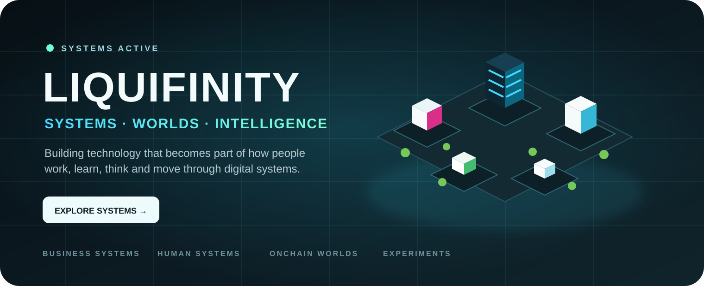
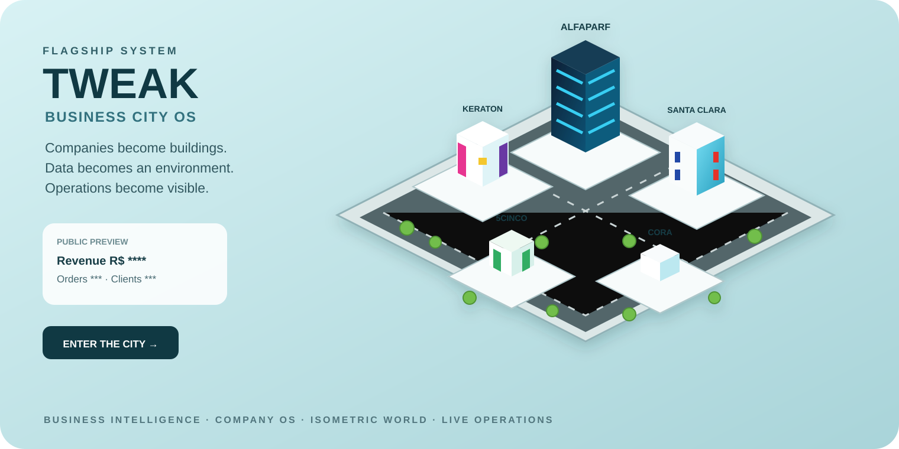
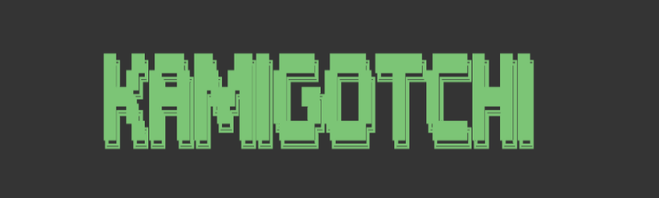
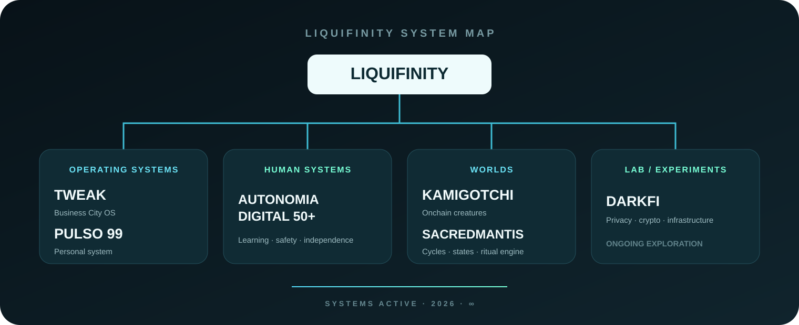

  

  
<strong>Construindo tecnologia que passa a fazer parte de como as pessoas trabalham, aprendem, pensam e se movem por sistemas digitais.</strong>

  

    <code>SISTEMAS OPERACIONAIS</code> ·
    <code>SISTEMAS HUMANOS</code> ·
    <code>MUNDOS ONCHAIN</code> ·
    <code>EXPERIMENTOS</code>
  

 

  

  <h2>TWEAK — CIDADE OPERACIONAL DE EMPRESAS</h2>
  
<strong>Empresas viram prédios. Dados viram ambiente. Operações se tornam visíveis.</strong>

  
<code>INTELIGÊNCIA DE NEGÓCIOS</code> · <code>AMBIENTES DE EMPRESA</code> · <code>MUNDO ISOMÉTRICO</code> · <code>OPERAÇÃO AO VIVO</code>

  
<a href="https://tweak-production.up.railway.app/"><strong>［ ENTRAR NA CIDADE → ］</strong></a>

 

## Sistemas

<table>
  <tr>
    <td width="50%" valign="top" align="center">
      
      <h3>PULSO 99</h3>
      
<strong>Sistema pessoal para consciência, respiração, alimentação e ferramentas.</strong>

      
<code>SISTEMA PESSOAL</code> · <code>BIBLIOTECA</code> · <code>RITUAIS</code>

      
<a href="https://pulsar99.com.br/"><strong>［ ABRIR SISTEMA ］</strong></a>

    </td>
    <td width="50%" valign="top" align="center">
      <h3>AUTONOMIA DIGITAL 50+</h3>
      
<strong>Educação tecnológica desenhada para independência digital real.</strong>

      
Android · iPhone · segurança digital · continuidade

      
<code>SISTEMA HUMANO</code> · <code>APRENDIZAGEM</code> · <code>SEGURANÇA</code>

      
<a href="https://autonomiadigital50mais.com.br/"><strong>［ CONHECER O PROJETO ］</strong></a>

    </td>
  </tr>
</table>

 

## Mundos

  

  
<code>YOMINET</code> · <code>INITIA</code> · <code>CICLO DE COLHEITA</code> · <code>SACREDMANTIS.EXE</code>

<table>
  <tr>
    <td align="center" width="20%">
       
      <code>INICIAR</code>
    </td>
    <td align="center" width="20%">
       
      <code>NÓ</code>
    </td>
    <td align="center" width="20%">
       
      <code>SINCRONIZAR</code>
    </td>
    <td align="center" width="20%">
       
      <code>REPOUSAR</code>
    </td>
    <td align="center" width="20%">
       
      <code>CICLO</code>
    </td>
  </tr>
</table>

<table>
  <tr>
    <td width="50%" valign="top">
      <h3>KAMIGOTCHI</h3>
      
Criaturas onchain, ciclos de colheita e estado persistente.

      
<a href="https://app.kamigotchi.io/"><strong>［ ENTRAR NO KAMIGOTCHI ］</strong></a>

    </td>
    <td width="50%" valign="top">
      <h3>SACREDMANTIS</h3>
      
Ciclos individuais, tempo, transições de estado e motor ritual.

      
<a href="https://prayingmantis.fun/"><strong>［ ABRIR SACREDMANTIS ］</strong></a>

    </td>
  </tr>
</table>

 

## Laboratório / Experimentos

<table>
  <tr>
    <td width="100%">
      <h3>DARKFI FAUCET LAB</h3>
      
Privacidade, infraestrutura cripto e padrões experimentais de interação.

      
<a href="https://github.com/Liquifinity/darkfi-faucet-lab"><strong>［ VER REPOSITÓRIO ］</strong></a>

    </td>
  </tr>
</table>

 

  

 

## Sistemas ativos

| Sistema | Função | Acesso |
|:--|:--|:--|
| `TWEAK` | cidade operacional de empresas | [abrir cidade](https://tweak-production.up.railway.app/) |
| `PULSO 99` | sistema operacional pessoal | [pulsar99.com.br](https://pulsar99.com.br/) |
| `AUTONOMIA DIGITAL 50+` | independência digital e aprendizagem | [site](https://autonomiadigital50mais.com.br/) |
| `KAMIGOTCHI` | mundo onchain | [app.kamigotchi.io](https://app.kamigotchi.io/) |
| `SACREDMANTIS` | motor de ciclos individuais | [prayingmantis.fun](https://prayingmantis.fun/) |

  LIQUIFINITY · SISTEMAS ATIVOS · 2026 · ∞

