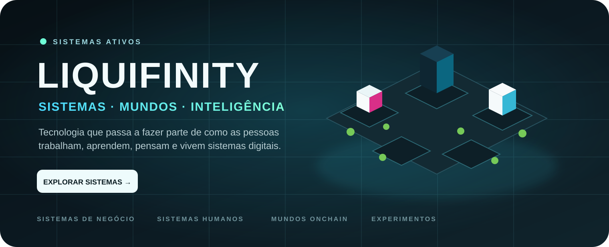
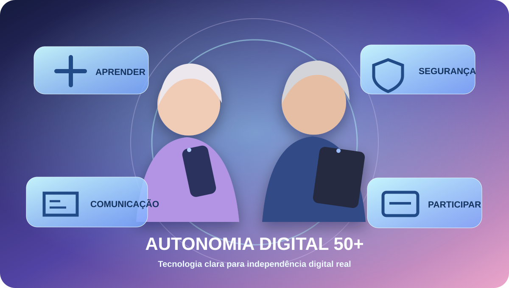
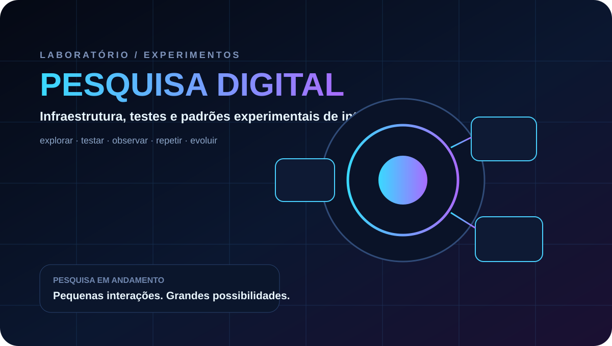

  
<strong>Tecnologia, produtos e experiências digitais organizados como um ecossistema.</strong>

  
<code>SISTEMAS</code> · <code>PESSOAS</code> · <code>MUNDOS</code> · <code>EXPERIMENTOS</code>

 

<h2>TWEAK — CIDADE OPERACIONAL DE EMPRESAS</h2>
<strong>Empresas viram prédios. Dados viram ambiente. Operações se tornam visíveis.</strong>

<a href="https://tweak-production.up.railway.app/"><strong>［ ENTRAR NA CIDADE → ］</strong></a>

 

## Sistemas

<table><tr>
<td width="50%" align="center" valign="top"><h3>PULSO 99</h3>
Sistema pessoal para consciência, respiração, alimentação e ferramentas.

<a href="https://pulsar99.com.br/"><strong>［ ABRIR SISTEMA ］</strong></a>
</td>
<td width="50%" align="center" valign="top"><h3>AUTONOMIA DIGITAL 50+</h3>
Educação tecnológica para independência digital real.

<a href="https://autonomiadigital50mais.com.br/"><strong>［ CONHECER O PROJETO ］</strong></a>
</td>
</tr></table>

 

## Mundos

<table><tr><td width="50%"><h3>KAMIGOTCHI</h3>
Mundo digital com criaturas, ciclos e estado persistente.
</td><td width="50%"><h3>SACREDMANTIS</h3>
Ciclos individuais, tempo e transições de estado.
</td></tr></table>

 

## Laboratório / Experimentos

<h3>DARKFI FAUCET LAB</h3>
Pesquisa digital, infraestrutura e padrões experimentais de interação.

<a href="https://github.com/Liquifinity/darkfi-faucet-lab"><strong>［ VER REPOSITÓRIO ］</strong></a>

 

LIQUIFINITY · SISTEMAS ATIVOS · 2026 · ∞

