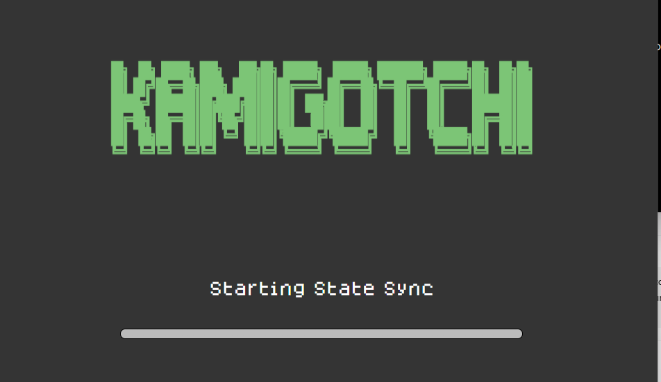

<p align="center">
  <a href="https://pulsar99.com.br/">
    
  </a>
</p>

<div align="center">
  <h3>PULSO 99</h3>
  <p><strong>Consciência · Respiração · Alimentação · Onchain pets</strong></p>
  <p><code>prisca sapientia</code> · <code>janela primordial</code> · <code>1999</code></p>
  <p>
    <a href="https://pulsar99.com.br/"><strong>［ PULSO 99 ］</strong></a>
    ·
    <a href="https://prayingmantis.fun/"><strong>［ SACREDMANTIS ］</strong></a>
    ·
    <a href="https://app.kamigotchi.io/"><strong>［ KAMIGOTCHI ］</strong></a>
  </p>
</div>

<br>

<p align="center">
  <a href="https://app.kamigotchi.io/">
    
  </a>
</p>

<p align="center">
  <code>YOMINET</code> · <code>INITIA</code> · <code>HARVEST LOOP</code> · <code>SACREDMANTIS.EXE</code>
</p>

<table>
  <tr>
    <td align="center" width="20%">
      <br>
      <sub><code>START</code></sub>
    </td>
    <td align="center" width="20%">
      <br>
      <sub><code>NODE</code></sub>
    </td>
    <td align="center" width="20%">
      <br>
      <sub><code>SYNC</code></sub>
    </td>
    <td align="center" width="20%">
      <br>
      <sub><code>REST</code></sub>
    </td>
    <td align="center" width="20%">
      <br>
      <sub><code>LOOP</code></sub>
    </td>
  </tr>
</table>

```text
KAMI INDEX  ->  NODE  ->  START HARVEST  ->  WAIT  ->  STOP HARVEST  ->  REST
```

| Sistema | Função | Acesso |
|:--|:--|:--|
| `SACREDMANTIS` | ciclos individuais de Kamigotchi | [prayingmantis.fun](https://prayingmantis.fun/) |
| `KAMIGOTCHI` | jogo onchain | [app.kamigotchi.io](https://app.kamigotchi.io/) |
| `PULSO 99` | biblioteca e sistema pessoal | [pulsar99.com.br](https://pulsar99.com.br/) |

<p align="center">
  <sub>SISTEMA ATIVO · PULSO 99 · SACREDMANTIS · 1999-∞</sub>
</p>
